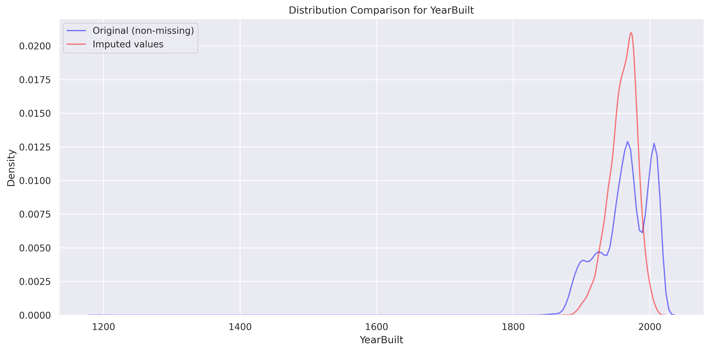

# Contextual Nearest Neighbor Imputation (CNNI)

A novel method for missing data imputation that combines elements of k-Nearest Neighbors (kNN) imputation with contextual information to provide more accurate and robust imputations.

## Features

- Context-aware imputation using temporal, spatial, and categorical information
- Adaptive k-neighbor selection based on local data density
- Comprehensive evaluation metrics (RMSE, MAE)
- Visualization tools for imputation results
- Support for multiple data types and missing data patterns

## Installation

1. Clone this repository:
```bash
git clone https://github.com/kchemorion/cnni.git
cd cnni
```

2. Install the package:
```bash
pip install -e .
```

## Usage

### Command Line Interface

The package provides a convenient command-line interface:

```bash
cnni your_data.csv --plot --output imputed_data.csv
```

#### CLI Options:
- Required argument: Path to input data file (CSV or Excel)
- `--max-k`: Maximum number of neighbors (default: 10)
- `--temporal-weight`: Weight for temporal context (default: 0.3)
- `--spatial-weight`: Weight for spatial context (default: 0.3)
- `--categorical-weight`: Weight for categorical context (default: 0.4)
- `--output`: Path to save imputed data (optional)
- `--plot`: Show imputation results plots (optional)

### Python API

You can also use CNNI programmatically in your Python code:

```python
from cnni import CNNImputer
import pandas as pd

# Load your data
data = pd.read_csv('your_data.csv')

# Initialize imputer
imputer = CNNImputer(
    max_k=10,
    temporal_weight=0.3,
    spatial_weight=0.3,
    categorical_weight=0.4
)

# Perform imputation
imputed_data = imputer.fit_transform(
    data,
    temporal_info=temporal_data,  # Optional
    spatial_info=spatial_data,    # Optional
    categorical_info=cat_data     # Optional
)

# Evaluate performance
rmse, mae = imputer.evaluate(true_data, imputed_data, mask)

# Visualize results
imputer.plot_results(true_data, imputed_data, mask)
```

### Data Format

The package automatically identifies context columns based on naming conventions and data types:

1. **Temporal Context**:
   - Columns with datetime type
   - Columns containing 'time' or 'date' in their names

2. **Spatial Context**:
   - Columns containing 'lat', 'lon', or 'location' in their names
   - First two spatial columns are used (assumed to be latitude/longitude)

3. **Categorical Context**:
   - Columns with object or category dtype
   - Automatically converted to dummy variables

Example CSV format:
```csv
timestamp,latitude,longitude,category,temperature,humidity,pressure
2024-01-01 00:00:00,37.7749,-122.4194,urban,15.2,65,1013.2
2024-01-01 01:00:00,37.7749,-122.4194,urban,14.8,67,1013.0
...
```

## Parameters

- `max_k`: Maximum number of neighbors to consider (default: 10)
- `temporal_weight`: Weight for temporal context (default: 0.3)
- `spatial_weight`: Weight for spatial context (default: 0.3)
- `categorical_weight`: Weight for categorical context (default: 0.4)
- `distance_metric`: Distance metric for nearest neighbors (default: 'euclidean')

## Visualization Examples

CNNI provides comprehensive visualizations to help understand the imputation results and validate the quality of imputed values. Here are some examples using a real estate dataset:

### Missing Value Patterns


This plot shows the distribution of missing values across different columns in the dataset. In our example:
- BuildingArea had the highest number of missing values (47.50%)
- YearBuilt was the second most affected (39.58%)
- Car and CouncilArea had relatively fewer missing values

### Distribution Comparisons



These density plots compare the distribution of original values (blue) with imputed values (red). The close alignment between distributions indicates that CNNI successfully preserves the statistical properties of the data.

### Spatial Distribution


These plots show the geographical distribution of original (blue) and imputed (red) values. The spatial coherence demonstrates CNNI's ability to consider location-based patterns during imputation.

### Correlation Matrix


The correlation heatmap shows relationships between numeric variables after imputation. Strong correlations (dark blue/red) indicate preserved relationships between variables, while lighter colors show weaker relationships.

### Key Insights from Visualizations:
1. **Distribution Preservation**: Imputed values follow similar patterns to original data
2. **Spatial Coherence**: Geographic patterns are maintained in the imputed values
3. **Relationship Preservation**: Variable correlations are preserved after imputation
4. **Missing Patterns**: Clear visualization of which columns required most imputation

These visualizations help validate that CNNI maintains the statistical properties, spatial patterns, and variable relationships present in the original data.

## Contributing

Feel free to submit issues, fork the repository, and create pull requests for any improvements.

## License

This project is licensed under the MIT License - see the LICENSE file for details.
